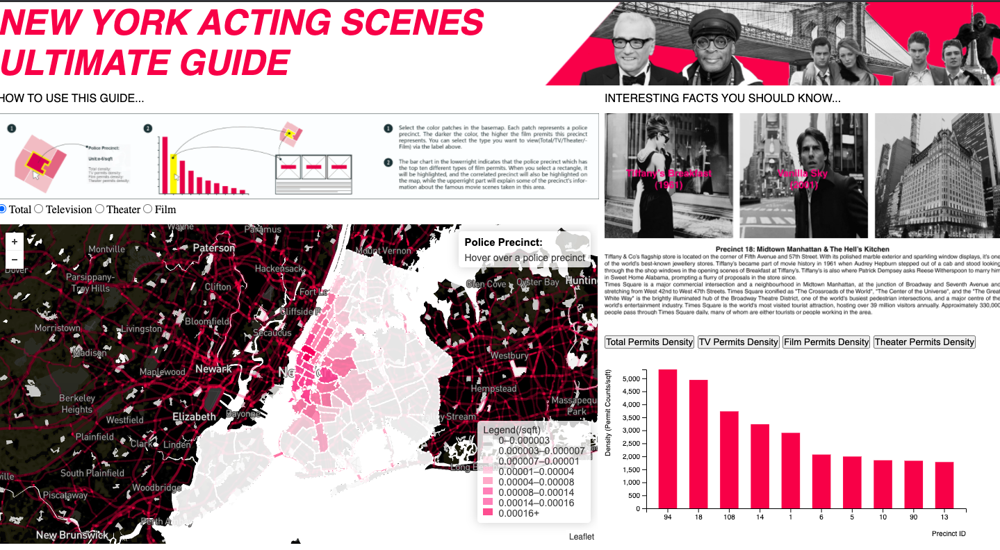

# joreeliu.github.io
It's for the data visualization course .

Aftering watching tons of movies which were shoot in NYC, we are curious about what places in
NYC are the most popular spots to filmmakers and directors. We want to visualize the data of
Film Permits in NYC to reveal the distribution of some areas that are frequently appeared in the
films because of their specific cultural identities, such as theater district and time square. 
 
Our targeted audiences are: Film fans and NYC enthusiast. We expect that they have some prior
knowledge of several classic films taken in NYC so that they can have a basic idea about these
popular acting scenes.Hopefully this can help them expand the scope of their knowledge about
NYC films and NYC’s cultural heritage and deepen the understanding and interest of New York
City.  
 
Our user interface design:

Which includes --
1. Instruction of how to use this website
2. Interactive bar charts with top ten most popular precincts of a particular category the
audience chooses.
3. An information box that gives you a brief introduction about the acting scenes of the
area the barchart highlights.
4. A choropleth map that shows the geographical distribution of the acting scenes with
some interactions.  
 
Our most important observations from this website are:  
1. Most of film permits happened in our familiar famous places. (Ex: Time Square,
Chinatown, Theater District)  
2. Except Manhattan, Brooklyn is the borough which has the most film permits.  
3. In terms of film permits, TV’s > Film’s > Theater’s  
4. Theater permits are highly concentrated in Theater District (Precinct14 & 18).
